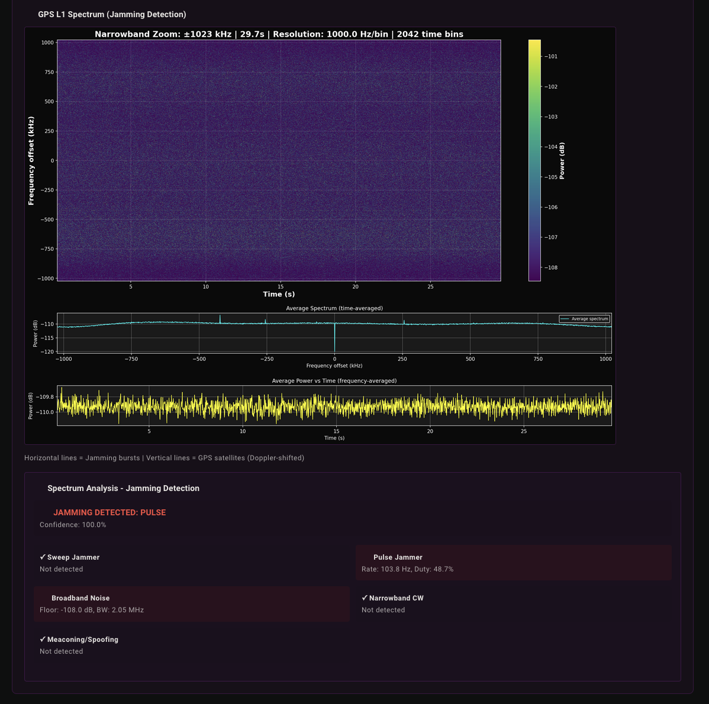
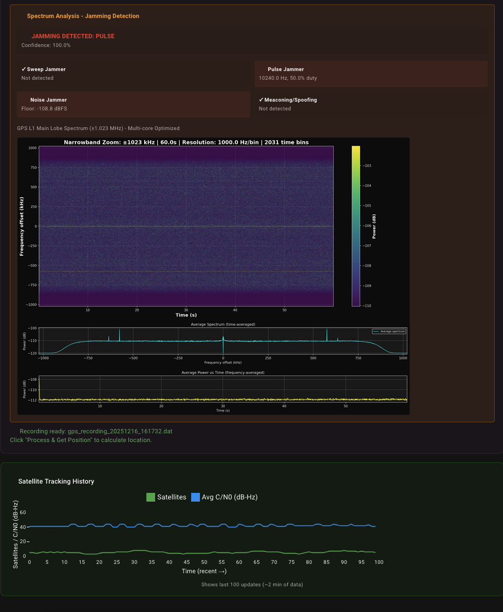

# web-spectrum

Web-based spectrum analyzer and GPS signal analysis platform.

Visit [patrykorwat.github.io/web-spectrum](https://meshuga.github.io/web-spectrum/) to access the app.

## Features
* **Spectrum analyzer** - Real-time frequency analysis
* **GPS signal recording & analysis** - Professional-grade GNSS processing
* **Data decoding** - ADS-B, ISM, and multi-constellation GNSS

## Supported Devices
* **tinySA Ultra** - Spectrum analyzer
* **RTL-SDR** (RTL2832U) - Including V4 dongles ($25-40)
* **SDRPlay** (RSPduo, RSP1A, etc.) - Professional SDR receivers ($200-300)

## Supported Browsers
* Chrome
* Edge
* Opera

See more: [caniuse.com/web-serial](https://caniuse.com/web-serial), [caniuse.com/webusb](https://caniuse.com/webusb)

## Installation

### Prerequisites
```bash
# Clone repository
git clone https://github.com/meshuga/web-spectrum.git
cd web-spectrum

# Install Node.js dependencies
npm install
```

### GNSS-SDR Installation (Required for GPS Analysis)

GNSS-SDR is required for professional GPS signal processing with both SDRPlay and RTL-SDR devices.

**macOS Installation:**
```bash
cd gnss-sdr
./install_gnss_sdr.sh
```

The installation script will:
- Install Homebrew dependencies (Boost, GLOG, Armadillo, etc.)
- Clone and build GNSS-SDR from source
- Install to `/usr/local/bin/gnss-sdr`
- Takes approximately 30-40 minutes

**Verify Installation:**
```bash
gnss-sdr --version
# Should output: gnss-sdr version 0.0.19
```

### SDRPlay API Installation

**macOS:**
```bash
# Download from SDRplay website
# https://www.sdrplay.com/downloads/
# Install SDRplay API v3.15 or later

# Verify installation
ls /Library/SDRplayAPI/
# Should show: 3.15.1 (or similar)
```

### Python Dependencies

Install all required Python packages using the comprehensive requirements file:

```bash
# Option 1: Standard installation (recommended)
pip3 install -r requirements.txt

# Option 2: macOS with Homebrew Python
pip3 install --break-system-packages -r requirements.txt

# Option 3: Using virtual environment (cleanest)
python3 -m venv venv
source venv/bin/activate  # On Windows: venv\Scripts\activate
pip install -r requirements.txt
```

**What's included:**
- `numpy` - Signal processing, FFT, correlation
- `websockets` - WebSocket server for real-time data streaming
- `requests` - HTTP client for Gypsum GPS decoder
- `python-dateutil` - Date parsing for GPS timestamps
- Other supporting libraries for GPS decoders

See [requirements.txt](requirements.txt) for the complete list with version constraints.

## Quick Start

### Start the Web Application
```bash
npm start
# Opens browser at http://localhost:3005
```

### Start Backend Services (Unified for Both Devices)

The recording backend now supports **both RTL-SDR and SDRPlay** automatically:

```bash
# Easy way: Use the startup script (from root directory)
./start_backend.sh
# This starts both HTTP API (port 5001) and WebSocket (port 8766)

# OR manually (from sdrplay-gps directory):
# Terminal 1: Start unified recording API server
cd sdrplay-gps
python3 recording_api_simple.py
# Listens on http://localhost:3001

# Terminal 2: Start GNSS-SDR bridge (for live position tracking)
python3 gnss_sdr_bridge.py
# Listens on ws://localhost:8766
```

**Backend Features:**
- ✅ **Auto-detection** - Detects which SDR device is available (RTL-SDR or SDRplay)
- ✅ **Dual decoder support** - Choose between GNSS-SDR (professional) or Gypsum (Python-based)
- ✅ **Format conversion** - Converts RTL-SDR uint8 to complex64 for GNSS-SDR
- ✅ **Automatic processing** - Generates spectrum analysis and jamming detection
- ✅ **WebSocket streaming** - Real-time processing logs to web UI

**Available GPS Decoders:**
1. **GNSS-SDR** (Default) - Professional C++ implementation
   - Accurate position fixes
   - Full NMEA/KML/GPX output
   - Multi-constellation support
   - Processing time: 5-10 minutes

2. **Gypsum** - Python-based GPS receiver
   - Educational and research-oriented
   - Faster processing (1-2 minutes)
   - Minimal dependencies
   - Good for learning GPS signal processing

Select decoder in the web UI under "GPS Decoder" dropdown.

### Using the GPS Recording Feature

1. **Open browser** at [http://localhost:3005](http://localhost:3005)
2. **Navigate** to SDRPlay or RTL-SDR Decoder page
3. **Configure duration**: Select recording duration (30s to 10m)
4. **Start recording**: Click "⏺ Start Recording"
5. **Wait for processing**: GNSS-SDR processes automatically
6. **View results**:
   - Spectrum waterfall showing GPS signals and jamming
   - Jamming detection analysis (pulse, sweep, noise, narrowband)
   - Position fix (latitude, longitude, altitude)
   - Satellite tracking status

**Recording Durations:**
- Quick test: 30-60 seconds (~468-937 MB)
- Standard: 2-5 minutes (~1.9-4.7 GB)
- Maximum: Up to 10 minutes (~9.4 GB)

## Device-Specific Features

### TinySA Ultra


**Spectrum Analyzer Mode:**
- Real-time frequency sweep and display
- Signal strength measurements
- Waterfall display

**Decode Mode:**
- Trigger-based signal capture
- Decodes messages up to ~24 bits
- Supports various modulation schemes

### RTL-SDR




**Browser Processing Mode:**
Direct in-browser signal decoding:
- **ADS-B** - Aircraft position tracking (1090 MHz)
- **ISM GateTX** - 433/868 MHz protocols
- **Basic GNSS** - GPS L1, Galileo E1, GLONASS L1OF, BeiDou B1I

**Professional Mode (GNSS-SDR):**

RTL-SDR dongles now work with GNSS-SDR for professional GPS signal analysis:

**Features:**
- ✅ **Configurable recordings** - 30s to 10 minutes (468 MB to 9.4 GB)
- ✅ **Automatic spectrum analysis** - Detects GPS satellites and jamming
- ✅ **Position calculation** - Latitude, longitude, altitude from GNSS-SDR
- ✅ **Jamming detection** - 5 types: pulse, sweep, noise, narrowband, meaconing
- ✅ **Format conversion** - Automatically converts uint8 to complex64
- ✅ **Web-based UI** - Monitor recordings and results in browser
- ✅ **Works with any RTL-SDR dongle** - $25-40 (RTL-SDR Blog V4 recommended)

**Recording Configuration:**
- Frequency: 1575.42 MHz (GPS L1 C/A)
- Sample rate: 2.048 MSPS
- Gain: 40 dB (configurable)
- Format: Complex64 (IQ) - auto-converted from RTL-SDR's uint8
- Works with active or passive GPS antennas

**Workflow:**
1. **Configure** → Select duration (30s-10m)
2. **Record** → RTL-SDR captures IQ samples to `.dat` file
3. **Process** → GNSS-SDR analyzes signal, tracks satellites
4. **Analyze** → Python generates spectrum waterfall and jamming metrics
5. **Display** → View results in web UI

**Output Files:**
- `gps_recording_YYYYMMDD_HHMMSS.dat` - Raw IQ samples (complex64)
- `gps_recording_YYYYMMDD_HHMMSS_spectrum.png` - Spectrum waterfall
- `gps_recording_YYYYMMDD_HHMMSS_spectrum_analysis.json` - Jamming metrics
- `gps_recording_YYYYMMDD_HHMMSS.nmea` - Position fixes (if satellites tracked)
- `gps_recording_YYYYMMDD_HHMMSS.kml` - Google Earth track (if satellites tracked)

### SDRPlay (RSPduo, RSP1A, etc.)



**Professional GPS Recording & Analysis:**

SDRPlay devices work with GNSS-SDR for professional-grade GPS signal analysis:

**Features:**
- ✅ **Configurable recordings** - 1 to 10 minutes (937 MB to 9.4 GB)
- ✅ **Automatic spectrum analysis** - Detects GPS satellites and jamming
- ✅ **Position calculation** - Latitude, longitude, altitude from GNSS-SDR
- ✅ **Jamming detection** - 5 types: pulse, sweep, noise, narrowband, meaconing
- ✅ **Direct API control** - Python-based SDRPlay API (no SoapySDR required)
- ✅ **Web-based UI** - Monitor recordings and results in browser
- ✅ **Dual-tuner support** - RSPduo Port 1 or Port 2 selection

**Recording Configuration:**
- Frequency: 1575.42 MHz (GPS L1 C/A)
- Sample rate: 2.048 MSPS
- Bandwidth: 1.536 MHz (captures GPS main lobe)
- Gain: 29 dB (prevents thermal issues)
- Format: Complex64 (IQ)
- Tuner: Selectable (RSPduo Tuner 1 or 2)
- Bias-T: Enabled for active antennas

**Workflow:**
1. **Configure** → Select duration (1m-10m) and tuner port
2. **Record** → SDRplay captures IQ samples to `.dat` file
3. **Process** → GNSS-SDR analyzes signal, tracks satellites
4. **Analyze** → Python generates spectrum waterfall and jamming metrics
5. **Display** → View results in web UI

**Output Files:**
- `gps_recording_YYYYMMDD_HHMMSS.dat` - Raw IQ samples (complex64)
- `gps_recording_YYYYMMDD_HHMMSS_spectrum.png` - Spectrum waterfall
- `gps_recording_YYYYMMDD_HHMMSS_spectrum_analysis.json` - Jamming metrics
- `gps_recording_YYYYMMDD_HHMMSS.nmea` - Position fixes (if satellites tracked)
- `gps_recording_YYYYMMDD_HHMMSS.kml` - Google Earth track (if satellites tracked)

**Supported Constellations:**
- GPS L1 C/A (USA) - 1575.42 MHz
- Galileo E1 (Europe) - 1575.42 MHz
- GLONASS L1OF (Russia) - 1602 MHz
- BeiDou B1I (China) - 1561.098 MHz

## References

YT videos with explanations and tests:
* [Web (r)evolution in lab electronics? Building a Web Spectrum Analyzer for TinySA Ultra](https://www.youtube.com/watch?v=XeK0TL0F8DI)
* [Signal decoding with TinySA Ultra](https://www.youtube.com/watch?v=bqgmftWSKPc)
* [RTL-SDR signal decoding in a web application](https://www.youtube.com/watch?v=Wm7sMXXT5Xs)

## Development

In the project directory, you can run:

### `npm start`

Runs the app in the development mode.\
Open [http://localhost:3005](http://localhost:3005) to view it in your browser.

The page will reload when you make changes.\
You may also see any lint errors in the console.

### `npm test`

Launches the test runner in the interactive watch mode.\
See the section about [running tests](https://facebook.github.io/create-react-app/docs/running-tests) for more information.

### `npm run build`

Builds the app for production to the `build` folder.\
It correctly bundles React in production mode and optimizes the build for the best performance.

The build is minified and the filenames include the hashes.\
Your app is ready to be deployed!

See the section about [deployment](https://facebook.github.io/create-react-app/docs/deployment) for more information.
